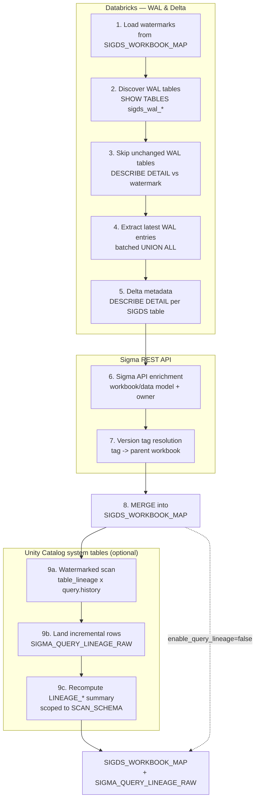

# writeback_info_dbx

A Databricks toolkit for inventorying and monitoring Sigma writeback (input table) activity across one or more Unity Catalog schemas. It maps every active writeback table pair — the SIGDS data table (`sigds_*`) and its SIGDS_WAL write-ahead-log table (`sigds_wal_*`) — to its Sigma workbook or data model, enriches records with Delta metadata and Sigma API ownership data, and populates a central `SIGDS_WORKBOOK_MAP` table for reporting and cleanup.

## Overview

When Sigma writebacks are enabled, Sigma creates a WAL table (`sigds_wal_*`) and a data table (`sigds_*`) in Databricks for each input table. Over time these accumulate — workbooks get archived, tables go stale, and orphaned WAL records are left behind. This toolkit provides visibility into that state so administrators can identify cleanup candidates and track the migration of writeback workbooks.

## Safe Archival of SIGDS and WAL Tables

**Read this before you act on anything this toolkit reports.** Everything else
in this README — the inventory, the scoring, the lineage cross-checks — exists
to feed this process safely. Getting archival wrong is not a minor mistake:

> **Incorrectly removing a SIGDS or WAL table can cause irreparable, immediate
> damage to the related Sigma content, and if the table was dropped rather
> than moved, it may not be recoverable at all.**

Sigma stores the exact fully-qualified table name of both the SIGDS data table and the WAL table in its internal metadata. When Sigma looks up an input table it searches for a table matching the exact `SIGDS_<uuid>` identifier in the writeback schema configured on the connection. If the table has been dropped or renamed, workbooks will immediately fail with errors such as:

```
Object '<DB>.<SCHEMA>."SIGDS_WAL_xxx"' does not exist or not authorized
```

This applies equally to the WAL table — Sigma holds the WAL table name in its metadata and requires an exact match.

> **Best practice: move first, delete later — never drop directly.**

### Recommended process

1. **Identify candidates** using `geninfo_queries.sql` or `archival_scoring.sql` (archived, orphaned, or stale records) — see [Analysis Queries](#analysis-queries) and [Archival Scoring](#archival-scoring-archival_scoringsql) below.
2. **Move** the SIGDS and WAL tables to a quarantine schema (e.g. `<SCHEMA>_quarantine`) using `ALTER TABLE ... RENAME TO`. Do not drop them yet.
3. **Monitor** for a safe period (recommended: 30 days minimum) to confirm no workbook errors are raised and no users report missing data.
4. **Drop** the tables from the quarantine schema once the safe period has passed.

### Why this matters

If a table is moved or renamed rather than dropped outright, recovery is straightforward — rename the table back to its original location (`<CATALOG>.<SCHEMA>.<SIGDS_TABLE_NAME>`) and the workbook resumes functioning immediately. A direct `DROP TABLE` is irreversible and eliminates this recovery path.

## Files

| File | Purpose |
|---|---|
| `databricks.yml` | Asset Bundle root — variables, dev/prod targets, deploy entrypoint |
| `resources/sigds_workbook_map.job.yml` | Job definition — `for_each`-over-schemas task running the populate notebook |
| `src/populate_sigds_workbook_map.py` | Main notebook — incrementally populates `SIGDS_WORKBOOK_MAP` from WAL tables and the Sigma API |
| `src/core.py` | Warehouse-agnostic, importable core — Sigma REST client (retry-enabled session, token, paginator) + pure helpers (ID indexing, WAL-record dedup, enrichment selection, legacy-WAL detection, progress bar). No Spark/dbutils; unit-testable and reusable by the Snowflake port |
| `tests/test_core.py` | Unit tests for `core.py` — pure logic + the paginator via a fake session; no Spark/network. Run with `pytest` |
| `sql/create_sigds_workbook_map.sql` | DDL reference — the notebook auto-creates the table on first run; use this only for manual/ahead-of-time provisioning |
| `sql/archival_scoring.sql` | Weighted confidence scoring matrix — scores every record across multiple signals to surface archival candidates |
| `sql/geninfo_queries.sql` | Reporting queries — landscape overview, storage reclamation, owner accountability, multi-table workbooks, legacy WAL inventory |
| `sql/query_history_lineage.sql` | Ground-truth workbook/data-model → input-table lineage mined from Unity Catalog `system.access.table_lineage` + `system.query.history`, cross-checked against `SIGDS_WORKBOOK_MAP` (manual/exploratory — full-window scan) |
| `SIGMA_QUERY_LINEAGE_RAW` *(auto-created)* | Watermarked landing table for Phase 8's incremental lineage scan (one row per statement × source table); not a source file, created in `map_schema` on first `enable_query_lineage=true` run |
| `sql/query_lineage_snapshot.sql` | Reporting view joining `SIGDS_WORKBOOK_MAP.LINEAGE_*` to `SIGMA_QUERY_LINEAGE_RAW` — reads only Phase 8's own output, no `system.*` grant needed |

This toolkit ships as a **Databricks Asset Bundle**: the populate notebook is
deployed once and run per writeback schema via a `for_each` task, configuration
is supplied as job parameters, and Sigma credentials are read from a Databricks
**secret scope** (never stored in the repo).

---

## Prerequisites

- Databricks CLI v0.218+ authenticated to the target workspace (`databricks auth login`)
- Unity Catalog access for the job's run identity: `SELECT` on the scan schema(s), `SELECT` + `MODIFY` on the map schema
- Sigma OAuth client credentials (`client_id` / `client_secret`) generated in Sigma — admin scope recommended for full org visibility (the scope to hold them is created in Setup step 1)
- Permission to create a Databricks secret scope (or an existing scope you can write to)
- Serverless job compute enabled, or a job cluster defined in `resources/sigds_workbook_map.job.yml`
- `requests` available in the runtime (standard on Databricks Runtime / serverless)

---

## Sigma details to gather first

Setup needs two values from Sigma: your **API base URL** (used in step 3) and a
pair of **OAuth client credentials** (used in step 1). Collect both before you
start.

### SIGMA_API_BASE

The base URL depends on the cloud and region your Sigma organisation is hosted on. The `/v2` suffix is required — all API calls are versioned under this path.

| Cloud / Region | Base URL |
|---|---|
| AWS US | `https://aws-api.sigmacomputing.com/v2` |
| AWS EU | `https://api.eu.aws.sigmacomputing.com/v2` |
| Azure US | `https://api.us.azure.sigmacomputing.com/v2` |
| GCP US | `https://api.us.gcp.sigmacomputing.com/v2` |

Your organisation's base URL can be found in the [Sigma API documentation](https://help.sigmacomputing.com/reference/get-started-sigma-api) — look for the **Base URL** section which lists all available endpoints by cloud provider and region. This is the value you put in the `sigma_api_base` variable in step 3.

### Generating Sigma client credentials

`client_id` and `client_secret` are OAuth 2.0 client credentials generated from within Sigma; you store them in the secret scope in step 1. You will need **Admin** access to your Sigma organisation to generate them.

To generate credentials:

1. In Sigma, go to **Administration → Developer Access**.
2. Click **Create New** under Client Credentials.
3. Give the credential a name (e.g. `sigds-workbook-map`), select **Admin** scope for full org visibility, and click **Create**.
4. Copy the **Client ID** and **Client Secret** immediately — the secret is only shown once.

Full instructions are available in the [Sigma API credentials documentation](https://help.sigmacomputing.com/reference/generate-client-credentials).

> **Note:** Admin scope is recommended so the job can resolve workbook ownership and see all workbooks regardless of folder permissions. A non-admin credential will still work but may return incomplete results for workbooks the credential owner cannot access.

---

## Setup

The bundle is deployed with the [Databricks CLI](https://docs.databricks.com/dev-tools/cli/) (v0.218+). Two required one-time steps (secret scope, bundle variables) plus an optional table-creation step, then deploy.

> **Where everything lives / where to run commands.** The bundle root is the
> `databricks.yml` file in **this `writeback_info_dbx/` folder** — the same
> folder as this README, alongside `src/`, `sql/`, and `resources/`. Run every
> `databricks bundle ...` command from inside this folder so the CLI can find
> `databricks.yml`:
>
> ```bash
> cd path/to/sigma_sandpit/writeback_info_dbx
> ```
>
> (The CLI searches the current directory and its parents for `databricks.yml`,
> so a subfolder works too — but `cd`-ing here is the simple, reliable choice.)

### 1. Create the secret scope (once)

Store the Sigma OAuth client credentials in a Databricks secret scope so they
never enter the repo or appear in logs. The default scope name is `sigma`
(override via the `secret_scope` parameter).

```bash
databricks secrets create-scope sigma
databricks secrets put-secret sigma client_id     --string-value "<YOUR_SIGMA_CLIENT_ID>"
databricks secrets put-secret sigma client_secret --string-value "<YOUR_SIGMA_CLIENT_SECRET>"
```

> For an Azure Key Vault- or AWS Secrets Manager-backed scope, create the scope
> against that backend instead; the notebook reads `client_id` / `client_secret`
> the same way via `dbutils.secrets.get`.

See [generating Sigma client credentials](#generating-sigma-client-credentials) above for how to obtain the values.

### 2. Create the table — optional

**You can skip this.** On its first run the notebook creates
`SIGDS_WORKBOOK_MAP` automatically (in `catalog.map_schema`) if it doesn't
already exist, using the same schema definition as the upsert — so the table and
the job can't drift. It's idempotent: every later run just confirms the table is
there.

You only need to provision it by hand if you'd rather create it ahead of time
(e.g. to grant permissions first, or apply table properties). To do that, run
`sql/create_sigds_workbook_map.sql` in Databricks SQL or a notebook, after
replacing the placeholders — the schema must be your `map_schema`:

```sql
-- Replace before running:
USE CATALOG <YOUR_CATALOG>;
USE SCHEMA  <YOUR_SCHEMA>;
```

> If you let the job auto-create on first run, keep the `for_each`
> `concurrency` at its default of `1` for that first run, so two schema
> iterations don't race to create the same table.

### 3. Set bundle variables

This is where you tell the job *which* catalog, schemas, and Sigma endpoint to
use. You do it by editing one file — `databricks.yml`, in this folder. If you've
never edited a YAML file, follow this exactly; the whole step is "find four
commented lines, remove the `#`, and type in your values".

#### 3a. The five variables

The first four are required; `secret_scope` only if you didn't name your scope
`sigma` in step 1.

| Variable | What to put | Where it comes from / example |
|---|---|---|
| `catalog` | Your Unity Catalog name | The catalog holding your writeback tables, e.g. `analytics` |
| `map_schema` | Schema that holds the `SIGDS_WORKBOOK_MAP` table | The same schema you used in step 2, e.g. `prod_writes` |
| `sigma_api_base` | Your Sigma API URL, ending in `/v2` | Pick your region from the [SIGMA_API_BASE](#sigma_api_base) table, e.g. `https://aws-api.sigmacomputing.com/v2` |
| `schemas` | The schema(s) to scan, as a quoted list | One: `'["prod_writes"]'`. Two: `'["prod_writes","dev_writes"]'` |
| `secret_scope` | *(optional)* scope name from step 1 | Omit unless you named it something other than `sigma` |

#### 3b. Make the edit

Open `databricks.yml` in this folder. Under the `dev:` target you'll see a host
line and a `variables:` block already filled with `<...>` placeholder tokens:

```yaml
  dev:
    mode: development
    default: true
    workspace:
      host: https://<your-databricks-workspace-url>
    variables:
      catalog: <your-catalog>
      map_schema: <your-map-schema>
      sigma_api_base: <your-sigma-api-base-url>
      schemas: '["<your-schema>"]'
```

**Replace each `<...>` token with your own value** — there's nothing to
uncomment, just overwrite the placeholders. After editing it looks like this:

```yaml
  dev:
    mode: development
    default: true
    workspace:
      host: https://acme.cloud.databricks.com
    variables:
      catalog: analytics
      map_schema: prod_writes
      sigma_api_base: https://aws-api.sigmacomputing.com/v2
      schemas: '["prod_writes"]'
```

Then save the file. (Use your own values, of course — the workspace host comes
from `databricks auth describe`, and `sigma_api_base` from the
[SIGMA_API_BASE](#sigma_api_base) table.)

To **scan several schemas in one job**, just add more names to the `schemas`
list — everything else stays the same. For example, to scan `prod_writes`,
`dev_writes`, and `team_sales` (all written into the single `map_schema` table):

```yaml
    variables:
      catalog: analytics
      map_schema: prod_writes
      sigma_api_base: https://aws-api.sigmacomputing.com/v2
      schemas: '["prod_writes","dev_writes","team_sales"]'
```

The job then runs the notebook once per entry in the list. See
[Multiple writeback schemas](#multiple-writeback-schemas) for the full worked
example.

When you're ready for production, fill in the `<...>` tokens under the `prod:`
target the same way (it already has a `schedule_pause: UNPAUSED` line above the
placeholders — leave that as is).

> If you leave a placeholder unfilled, the job fails fast with a clear
> *"Parameter(s) still contain placeholder values"* error rather than a cryptic
> catalog-not-found failure.

#### 3c. YAML rules that will bite you if you ignore them

- **Only change what's to the right of the colon.** The placeholder lines are
  already indented correctly — just overwrite the `<...>` value, don't move the
  line. Changing the leading spaces (or replacing them with a tab) breaks the
  file.
- **Spaces, never tabs.** If your editor inserts a tab, the file won't parse.
  (VS Code: click "Spaces" / "Tab" in the bottom status bar to switch.)
- **Keep the quotes around `schemas`.** It stays `schemas: '["prod_writes"]'` —
  single quotes outside, double quotes inside. It's one string the job splits
  into a list, *not* a YAML list. One schema is still a one-element list.
- **`map_schema` is fixed; `schemas` is what varies.** The job always writes its
  output into `map_schema` and scans each entry in `schemas`. To cover more
  schemas later you only add names to `schemas`.
- **`map_schema` must match the schema you used in step 2's DDL.**

#### 3d. Check it parsed

After saving, confirm the file is valid before deploying:

```bash
databricks bundle validate -t dev
```

You want `Validation OK!`. A YAML error here almost always means a stray tab, a
misaligned line, or a missing quote around `schemas` — re-check 3c.

> **Alternative (no file editing).** You can instead pass values on the command
> line at deploy time using environment variables:
>
> ```bash
> BUNDLE_VAR_catalog=analytics \
> BUNDLE_VAR_map_schema=prod_writes \
> BUNDLE_VAR_sigma_api_base=<your-sigma-api-base-url> \
> BUNDLE_VAR_schemas='["prod_writes"]' \
>   databricks bundle validate -t dev
> ```
>
> Use the `BUNDLE_VAR_` form, not `--var="schemas=..."` — the `--var` parser
> chokes on the quotes and brackets in the `schemas` value.

### 4. Deploy and run

```bash
databricks bundle validate -t dev          # check the bundle resolves
databricks bundle deploy   -t dev          # deploy the job to the workspace
databricks bundle run sigds_workbook_map -t dev   # run on demand
```

Swap `-t dev` for `-t prod` for the production target (which unpauses the daily
schedule). The `for_each` task runs the populate notebook once per schema in
`schemas`, keeping `map_schema` fixed — no file edits between schemas.

### Watching progress

`databricks bundle run` waits for the run to finish (pass `--no-wait` to return
immediately) and prints a **run-page URL** plus the run's state transitions. You
get progress at two levels:

- **In the terminal / run logs.** The notebook logs its phases as
  `[Phase n/8] …` (phase 8 is the optional query-history lineage enrichment —
  see below), and the long-running steps draw an ASCII bar, e.g.:

  ```
  [Phase 3/8] Discovered 1,222 WAL tables. Running parallel DESCRIBE DETAIL…
    DESCRIBE WAL ▕███████████░░░░░░░░░░░░░▏ 560/1222
  [Phase 4/8] Extracted 87 new/updated SIGDS table records.
  ```

- **On the run page (UI).** Open the printed URL to watch the `for_each` task as
  a matrix — one tile per schema, going grey → running → green — and to see each
  iteration's full notebook output live.

For graphical `tqdm` bars in the notebook UI, set the `use_tqdm` parameter to
`true` (job parameter or `--params use_tqdm=true`). It has no effect on the
plain-text CLI logs. Other tuning parameters: `describe_workers`,
`wal_batch_size`, `max_wal_tables`, `enable_query_lineage`, `lineage_lookback_days`.

### Compute

The job runs on **serverless** job compute by default (no cluster to manage).
If serverless is not enabled on your workspace, uncomment the `job_clusters`
block in `resources/sigds_workbook_map.job.yml` and set a `node_type_id` /
`spark_version` for your cloud, then add `job_cluster_key` to the task.

---

## Maintenance & migration notes

### Upgrading an existing table (SOURCE_SCHEMA → SCAN_SCHEMA)

If you ran an earlier version, your table will have a column called `SOURCE_SCHEMA`. Delta requires column mapping to be enabled before a rename can be performed:

```sql
-- Step 1: enable column mapping (one-time, metadata-only)
ALTER TABLE <YOUR_CATALOG>.<YOUR_MAP_SCHEMA>.SIGDS_WORKBOOK_MAP
SET TBLPROPERTIES (
  'delta.columnMapping.mode' = 'name',
  'delta.minReaderVersion'   = '2',
  'delta.minWriterVersion'   = '5'
);

-- Step 2: rename the column
ALTER TABLE <YOUR_CATALOG>.<YOUR_MAP_SCHEMA>.SIGDS_WORKBOOK_MAP
  RENAME COLUMN SOURCE_SCHEMA TO SCAN_SCHEMA;
```

No data is rewritten — both steps are metadata-only operations.

### Upgrading an existing table (renamed LINEAGE_* columns)

If you enabled `enable_query_lineage` before this rename, four columns were
renamed to stop reusing the word "source"/"workbook" for unrelated things
(the object that queried a table vs. the object that wrote it vs. whether the
Sigma tag comment was recovered):

| Old name | New name |
|---|---|
| `LINEAGE_LAST_WORKBOOK_URL` | `LINEAGE_LAST_QUERIED_OBJECT_URL` |
| `LINEAGE_LAST_SOURCE_OBJECT_KIND` | `LINEAGE_LAST_QUERIED_OBJECT_KIND` |
| `LINEAGE_LAST_SOURCE_OBJECT_ID` | `LINEAGE_LAST_QUERIED_OBJECT_ID` |
| `LINEAGE_ATTRIBUTION_SOURCE` | `LINEAGE_TAG_STATUS` |

Same column-mapping prerequisite as above (skip Step 1 if you already enabled
it for the `SOURCE_SCHEMA` migration):

```sql
ALTER TABLE <YOUR_CATALOG>.<YOUR_MAP_SCHEMA>.SIGDS_WORKBOOK_MAP
SET TBLPROPERTIES (
  'delta.columnMapping.mode' = 'name',
  'delta.minReaderVersion'   = '2',
  'delta.minWriterVersion'   = '5'
);

ALTER TABLE <YOUR_CATALOG>.<YOUR_MAP_SCHEMA>.SIGDS_WORKBOOK_MAP
  RENAME COLUMN LINEAGE_LAST_WORKBOOK_URL TO LINEAGE_LAST_QUERIED_OBJECT_URL;
ALTER TABLE <YOUR_CATALOG>.<YOUR_MAP_SCHEMA>.SIGDS_WORKBOOK_MAP
  RENAME COLUMN LINEAGE_LAST_SOURCE_OBJECT_KIND TO LINEAGE_LAST_QUERIED_OBJECT_KIND;
ALTER TABLE <YOUR_CATALOG>.<YOUR_MAP_SCHEMA>.SIGDS_WORKBOOK_MAP
  RENAME COLUMN LINEAGE_LAST_SOURCE_OBJECT_ID TO LINEAGE_LAST_QUERIED_OBJECT_ID;
ALTER TABLE <YOUR_CATALOG>.<YOUR_MAP_SCHEMA>.SIGDS_WORKBOOK_MAP
  RENAME COLUMN LINEAGE_ATTRIBUTION_SOURCE TO LINEAGE_TAG_STATUS;
```

Then re-run `sql/archival_scoring.sql` and `sql/query_lineage_snapshot.sql` to
recreate the views against the renamed columns (`CREATE OR REPLACE VIEW`, so
this is a no-op if you haven't touched them).

### Multiple writeback schemas

`SIGDS_WORKBOOK_MAP` supports multiple writeback schemas in a single table. Every row is stamped with the `SCAN_SCHEMA` value from the run that produced it, so results from different schemas remain distinguishable. The MERGE key is the composite `SIGDS_TABLE + SCAN_SCHEMA`, preventing collisions when the same bare table name exists in more than one schema.

To cover multiple schemas, list them all in the `schemas` bundle variable — the
`for_each` task runs the populate notebook once per entry, with `map_schema`
held fixed. **The only thing that changes versus a single-schema setup is the
`schemas` list** — add more names and you scan more schemas.

#### Worked example — scan three schemas in one job

Say your writeback tables live across `prod_writes`, `dev_writes`, and
`team_sales`, and you want them all inventoried into one `SIGDS_WORKBOOK_MAP`
table in `prod_writes`. Configure the `prod` target like this:

```yaml
# databricks.yml
targets:
  prod:
    mode: production
    workspace:
      host: https://<your-databricks-workspace-url>
      root_path: /Workspace/Users/${workspace.current_user.userName}/.bundle/${bundle.name}/${bundle.target}
    variables:
      schedule_pause: UNPAUSED
      catalog: analytics
      map_schema: prod_writes
      sigma_api_base: <your-sigma-api-base-url>
      schemas: '["prod_writes","dev_writes","team_sales"]'
```

Then deploy and run as normal:

```bash
databricks bundle validate -t prod
databricks bundle deploy   -t prod
databricks bundle run sigds_workbook_map -t prod
```

What happens on that single run: the `for_each` task fires the populate notebook
**three times** — once with `scan_schema=prod_writes`, once with
`scan_schema=dev_writes`, once with `scan_schema=team_sales` — each scanning its
own schema's `sigds_wal_*` tables. All three write into the one
`analytics.prod_writes.SIGDS_WORKBOOK_MAP` table (the `map_schema`), each row
stamped with the `SCAN_SCHEMA` it came from. To add or drop a schema later, edit
only the `schemas` list and redeploy — nothing else changes.

> By default the iterations run **one at a time** (`concurrency: 1` in
> `resources/sigds_workbook_map.job.yml`), which keeps Sigma API and warehouse
> load predictable. If you have many schemas and want them to run in parallel,
> raise that `concurrency` value.

Every iteration writes to the same `SIGDS_WORKBOOK_MAP` table. All analysis queries (`archival_scoring.sql`, `geninfo_queries.sql`) include `SCAN_SCHEMA` in their output so you can filter or group by schema. Sigma API enrichment (workbook names, owner details) is shared across schemas — a `WORKBOOK_ID` seen in any previous run is not re-fetched.

---

## How it works — the 9-phase pipeline

Each run pulls from three independent sources — WAL/Delta metadata, the Sigma
API, and (optionally) Unity Catalog system tables — and merges them into
`SIGDS_WORKBOOK_MAP`, with query-history lineage landing in its own table
alongside it:



Each run follows these steps:

1. **Load watermarks** — reads stored `WAL_TABLE_LAST_MODIFIED` timestamps and known `WORKBOOK_ID`s from `SIGDS_WORKBOOK_MAP` in a single query.
2. **Discover WAL tables** — runs `SHOW TABLES` to find all `sigds_wal_*` tables in the schema.
3. **Skip unchanged WAL tables** — runs `DESCRIBE DETAIL` in parallel on every WAL table and compares `lastModified` against the stored watermark. WAL tables with no new writes are skipped entirely (no row scans).
4. **Extract latest WAL entries** — reads the most recent WAL row per SIGDS table from changed WAL tables using batched `UNION ALL` queries (one Spark job per batch of up to 100 tables).
5. **Delta metadata** — runs `DESCRIBE DETAIL` in parallel for each new or changed SIGDS table to capture table ID, location, size, and timestamps.
6. **Sigma API enrichment** — fetches workbook/data-model metadata only for `WORKBOOK_ID`s not already in the table. Resolves owner names via `GET /v2/members`. `API_IS_ARCHIVED` is re-checked on every run for all known IDs.
7. **Version tag resolution** — fetches all version tags via `GET /v2/tags`, then lists workbooks per tag to build a `taggedWorkbookId → parent workbook` mapping. Tagged version records are flagged with `IS_TAGGED_VERSION=TRUE`, `VERSION_TAG_NAME`, and `PARENT_WORKBOOK_ID`.
8. **MERGE** — writes all changes into `SIGDS_WORKBOOK_MAP` via a single `MERGE` keyed on the composite `SIGDS_TABLE + SCAN_SCHEMA`. Records whose WAL table has disappeared are flagged `IS_DELETED=TRUE`; the flag is cleared if the WAL table reappears. All deletion and orphan flag updates are scoped to the current `SCAN_SCHEMA` so other schemas' rows are never affected.
9. **Query-history lineage enrichment — optional, `enable_query_lineage=true`.** Joins `system.access.table_lineage` to `system.query.history` and parses the Sigma comment tag to find which workbook/data model actually SELECTed each table. The first run per schema backfills `lineage_lookback_days`; every later run scans only from the last watermark (minus `lineage_overlap_hours`), landing new rows into `SIGMA_QUERY_LINEAGE_RAW` — so it never re-reads the whole window from the system tables. The rolling-window `LINEAGE_*` summary on `SIGDS_WORKBOOK_MAP` is then recomputed from that small local table (scoped to `SCAN_SCHEMA`). Off by default and degrades to a WARN + skip (never fails the run) if the required system-table grant is missing. See [Query-History Lineage](#query-history-lineage-query_history_lineagesql) below.

---

## SIGDS_WORKBOOK_MAP — key columns

Column names use consistent prefixes to make the data source immediately obvious:
- **`WAL_`** — sourced from WAL row data or WAL table metadata
- **`SIGDS_`** — sourced from `DESCRIBE DETAIL` on the writeback data table
- **`API_`** — sourced from the Sigma REST API

| Column | Description |
|---|---|
| `SIGDS_TABLE` | Bare SIGDS table name — part of composite primary key |
| `SCAN_SCHEMA` | Schema that was scanned to produce this row — part of composite primary key |
| `WAL_TABLE_FQN` | Fully-qualified WAL table name (`catalog.schema.sigds_wal_*`) |
| `WAL_DS_ID` | Input table dataset ID extracted from the WAL record |
| `WAL_WORKBOOK_URL` | Workbook URL extracted from WAL METADATA (`sigmaUrl` / `workbookUrl`) |
| `WAL_INPUT_TABLE_NAME` | Input table element title extracted from WAL METADATA |
| `WAL_LAST_EDIT_AT` | Timestamp of the latest WAL row for this SIGDS table |
| `WAL_LAST_EDIT_BY` | Email of the user who made the last edit, from WAL METADATA |
| `WAL_MAX_EDIT_NUM` | Highest `EDIT_NUM` seen in the WAL for this SIGDS table |
| `WAL_TABLE_LAST_MODIFIED` | Watermark — `lastModified` from `DESCRIBE DETAIL` on the WAL table at last processing |
| `SIGDS_TABLE_ID` | Delta table GUID from `DESCRIBE DETAIL` on the SIGDS table |
| `SIGDS_TABLE_LOCATION` | Cloud storage path of the SIGDS Delta table |
| `SIGDS_TABLE_CREATED_AT` | Timestamp when the SIGDS Delta table was first created |
| `SIGDS_TABLE_LAST_MODIFIED` | Timestamp of the most recent write to the SIGDS Delta table |
| `SIGDS_TABLE_SIZE_BYTES` | Current on-disk size of the SIGDS Delta table in bytes |
| `WORKBOOK_ID` | Sigma workbook or data model ID |
| `WORKBOOK_NAME / PATH` | Display name and folder path (from Sigma API) |
| `OBJECT_TYPE` | `WORKBOOK` or `DATA_MODEL` |
| `ORG_SLUG` | Sigma org slug parsed from the workbook URL |
| `IS_ORPHANED` | `TRUE` when the SIGDS data table no longer exists in Databricks |
| `IS_DELETED` | `TRUE` when the WAL table has disappeared from the schema |
| `IS_LEGACY_WAL` | `TRUE` for old `sigds_wal_<uuid>` naming (pre-DS_ID convention) |
| `IS_TAGGED_VERSION` | `TRUE` when the workbook ID is a version tag (e.g. Prod, QA) |
| `VERSION_TAG_NAME` | Name of the version tag when `IS_TAGGED_VERSION` is TRUE |
| `PARENT_WORKBOOK_ID` | Source workbook ID when `IS_TAGGED_VERSION` is TRUE |
| `API_WORKBOOK_URL` | Workbook URL from the Sigma API — set once on first enrichment |
| `API_OWNER_ID` | Sigma member UUID of the workbook owner (from Sigma API) |
| `API_IS_ARCHIVED` | Archived state from Sigma API — refreshed every run |
| `API_OWNER_FIRST_NAME` | Owner first name resolved via `GET /v2/members` — set once |
| `API_OWNER_LAST_NAME` | Owner last name resolved via `GET /v2/members` — set once |
| `LINEAGE_SELECT_COUNT` | Count of SELECTs against this table in the last `lineage_lookback_days` |
| `LINEAGE_DISTINCT_QUERY_COUNT` | Distinct `statement_id`s behind that count (one query can touch a table more than once) |
| `LINEAGE_LAST_QUERIED_AT` | Timestamp of the most recent observed SELECT |
| `LINEAGE_LAST_QUERIED_BY_EMAIL` | Email of the user who issued that most recent SELECT |
| `LINEAGE_LAST_QUERIED_OBJECT_URL` | URL of the workbook/data model that issued the most recent SELECT — can differ from `WAL_WORKBOOK_URL` / `API_WORKBOOK_URL`, which describe the last *write*, not the last *read* |
| `LINEAGE_LAST_QUERIED_OBJECT_KIND` | `WORKBOOK` or `DATA_MODEL` — which kind of object issued that SELECT |
| `LINEAGE_LAST_QUERIED_OBJECT_ID` | Sigma object ID parsed from that URL |
| `LINEAGE_TAG_STATUS` | `query_history` if Sigma's comment tag was recovered from the query text (confident attribution), `query_history_untagged` if a SELECT was observed but the tag wasn't (e.g. a non-adhoc query kind) |
| `LINEAGE_REFRESHED_AT` | When Phase 8 last recomputed this row's `LINEAGE_*` summary for its `SCAN_SCHEMA` |

`LINEAGE_*` columns are query-history lineage enrichment (Phase 8, `enable_query_lineage=true` only) — added on demand via `ALTER TABLE ADD COLUMNS`, absent until first enabled. See [Query-History Lineage](#query-history-lineage-query_history_lineagesql).

---

## Analysis Queries

`geninfo_queries.sql` covers the same analytical dimensions as `archival_scoring.sql` (status flags, edit recency, edit volume, storage, legacy WAL, version tags) but as exploratory reporting views rather than a scoring engine. Replace `<YOUR_CATALOG>` and `<YOUR_SCHEMA>` before running.

| Query | What it shows |
|---|---|
| 1. Landscape overview | Per-schema summary: total tables, orphaned/deleted/archived counts, total and reclaimable storage (GB) |
| 2. Storage reclamation opportunity | All tables with a clear archival signal (orphaned, deleted, or archived workbook), ranked by size with the primary reason surfaced |
| 3. Active workbooks going stale | Active workbooks where writeback activity has dropped off, grouped into inactivity bands (31–90 / 91–180 / 181–365 / >365 days) |
| 4. Most active writeback tables | Highest-edit-volume input tables — the inverse archival view; useful for identifying business-critical tables before any cleanup nearby |
| 5. Owner accountability summary | Cleanup burden rolled up by workbook owner: archived, orphaned, stale counts and reclaimable GB per owner |
| 6. Workbooks with multiple input tables | Groups by source workbook (resolving tagged versions to their parent) to find workbooks with more than one named input element. Shows named element count, total SIGDS file count (inflated by repeated tag updates), and how many schemas the workbook spans |
| 7. Legacy WAL inventory | All `sigds_wal_<uuid>` tables, split by migration priority: active legacy WALs (still being written) flagged as urgent; inactive as low-priority |

---

## Query-History Lineage (`query_history_lineage.sql`)

`SIGDS_WORKBOOK_MAP` links a SIGDS table to its workbook/data model via the
`WORKBOOK_ID` embedded in WAL row metadata — a strong signal, but a heuristic:
it reflects the last *write*, not who is currently *reading* the table.
`query_history_lineage.sql` adds a second, independent signal mined straight
from Unity Catalog system tables: every SELECT Sigma issues carries a trailing
SQL comment identifying the exact workbook or data model that generated it —

```
-- Sigma Σ {"sourceUrl":"https://app.sigmacomputing.com/acme/workbook/My-WB-527Ldxl0hT3JKHuLw1USp4?:displayNodeId=fk0QY3zA9x","kind":"adhoc","request-id":"...","user-id":"...","email":"user@example.com"}
```

Joining `system.access.table_lineage` to `system.query.history` on
`statement_id` recovers that comment for every observed SELECT against a
writeback table, so it's ground truth for "which workbook/data model is
actually reading this table right now" — the direct fix for a WAL heuristic
that can under- or over-report staleness.

This is an **enhancement, not a replacement**: a table with no lineage rows
means "not observed in the lookback window", not "orphaned" — the WAL-based
map stays the primary signal.

There are three pieces, in two layers — an ingestion layer that needs
`system.*` access, and a reporting layer that doesn't:

- **Automated (Phase 8 of the populate notebook)** — set `enable_query_lineage:
  "true"` (per-schema, in `resources/sigds_workbook_map.job.yml` or as a job
  parameter). This is **watermarked, not a full re-scan every run**:

  1. **First run for a given `scan_schema`** — no watermark exists yet, so it
     backfills `lineage_lookback_days` (default 90) of
     `system.access.table_lineage` / `system.query.history`.
  2. **Every later run** — resumes from the latest `EVENT_TIME` already landed
     for that schema, minus `lineage_overlap_hours` (default 6) to cover
     system-table landing latency. Only that incremental delta is read from
     the (potentially metastore-wide, expensive-to-scan) system tables.
  3. The incremental rows land in a new table, **`SIGMA_QUERY_LINEAGE_RAW`**
     (auto-created in `map_schema`, one row per statement × source table),
     `MERGE`d in keyed on `(SCAN_SCHEMA, SIGDS_TABLE, STATEMENT_ID)` so the
     overlap buffer re-reading a few hours it already landed doesn't
     double-count. Rows older than `lineage_lookback_days` +
     `lineage_overlap_hours` are pruned each run — nothing older is ever read
     by the next step, so there's no reason to keep it.
  4. The `LINEAGE_*` column set on `SIGDS_WORKBOOK_MAP` —
     `LINEAGE_SELECT_COUNT`, `LINEAGE_DISTINCT_QUERY_COUNT`,
     `LINEAGE_LAST_QUERIED_AT`, `LINEAGE_LAST_QUERIED_OBJECT_URL`,
     `LINEAGE_LAST_QUERIED_OBJECT_KIND`, `LINEAGE_LAST_QUERIED_OBJECT_ID`,
     `LINEAGE_LAST_QUERIED_BY_EMAIL`, `LINEAGE_TAG_STATUS`,
     `LINEAGE_REFRESHED_AT` (columns are added automatically via `ALTER TABLE
     ADD COLUMNS` the first time this runs) — is then recomputed fresh from
     `SIGMA_QUERY_LINEAGE_RAW` every run, scoped to `lineage_lookback_days`.
     This recompute is a full rescan, but only of the small local raw table,
     not the system tables — so a table with no SELECTs in the current window
     correctly resets to zero/NULL rather than keeping a stale count from
     months ago, without re-reading months of system-table history to prove
     it.

  If the required system-table grant is missing, Phase 8 logs a WARN and
  skips — it never fails the run. This is the only piece that touches
  `system.access` / `system.query` directly.
- **Reporting (`sql/query_lineage_snapshot.sql`)** — a view,
  `V_SIGDS_LINEAGE_SNAPSHOT`, joining `SIGDS_WORKBOOK_MAP.LINEAGE_*` back onto
  `SIGMA_QUERY_LINEAGE_RAW` for a couple of facts only the raw table can
  answer (distinct querying users, distinct source objects touching the same
  table), plus a `LINEAGE_CROSS_CHECK` flag distinguishing "not yet scanned"
  from "scanned, no activity" from "flagged for cleanup but actively queried
  — worth a look". Reads only the two tables Phase 8 already writes, so it
  needs no `system.*` grant — safe to hand to a BI/reporting identity that
  should never see raw account-usage data.
- **Manual / exploratory (`sql/query_history_lineage.sql`)** — run directly in
  a SQL editor (after replacing `<YOUR_CATALOG>` / `<YOUR_SCHEMA>`) for ad-hoc
  investigation, independent of whether Phase 8 has ever run. Always scans the
  full `lineage_lookback_days` window directly against the system tables (no
  watermark/landing table — fine for an occasional manual query, not intended
  to run on a schedule). Creates:

| Object | Grain | Purpose |
|---|---|---|
| `V_SIGMA_QUERY_LINEAGE` | one row per (statement, table) | Raw parsed lineage: `SIGDS_TABLE`, `SOURCE_OBJECT_KIND` (`WORKBOOK` / `DATA_MODEL`), `SOURCE_OBJECT_ID`, `SOURCE_ORG_SLUG`, `SIGMA_USER_EMAIL`, `SIGMA_KIND`, `LINEAGE_TAG_STATUS` |
| `V_SIGMA_QUERY_LINEAGE_SUMMARY` | one row per `SIGDS_TABLE` + `SCAN_SCHEMA` | Rolled up to the same grain as `SIGDS_WORKBOOK_MAP` — `SELECT_COUNT_90D`, `LAST_QUERIED_AT`, and the most recently observed source workbook/data model — ready to join |
| Final `SELECT` in the file | one row per `SIGDS_TABLE` | Cross-check example: joins the summary onto `SIGDS_WORKBOOK_MAP` and flags tables the WAL heuristic marked for cleanup that were nonetheless actively queried in the last 90 days |

**Prerequisites:** the account admin must enable the `access` and `query`
system schemas (Catalog Explorer → System Tables — a one-time, account-level
step), and the identity running this needs `SELECT` on
`system.access.table_lineage` and `system.query.history`.

**Caveats:** `table_lineage` retention is 365 days; both system tables land
with a short delay (treat the most recent few minutes as provisional); only
`kind='adhoc'` queries are guaranteed to carry the tag (other kinds are
surfaced via `LINEAGE_TAG_STATUS` rather than silently dropped); scope
is per-metastore (cross-workspace writeback is out of scope). Unlike the
Snowflake port's `sigma_query_history_scan` proc, no separate "land into raw"
step is needed — Unity Catalog system tables are already persisted with their
own retention, so the views can be queried live.

---

## Archival Scoring (`archival_scoring.sql`)

The script creates one view, `SIGDS_ARCHIVAL_SCORED` (single source of truth for the logic), then runs three queries: **archival candidates**, a **tier rollup**, and a **dangling-cleanup** list. It deliberately keeps three different questions apart rather than blending them into one number:

- **`ARCHIVABILITY_SCORE` (0–100)** — *is this writeback dead and reclaimable?* This is the score.
- **`SIGDS_TABLE_SIZE_MB`** — *how much would we reclaim?* A priority axis: shown as a column and used only as a sort tie-breaker, **not added to the score** (a large active table must not outrank a tiny dead one).
- **`MIGRATION_PRIORITY`** — legacy (pre-MultiWAL) tables to **migrate, not archive**: a flag, not scored.

**Orphaned records** (the SIGDS data table is already gone) are reported by a **separate dangling-cleanup query** — there's nothing to quarantine, so they're kept out of the scored tiers entirely.

### Scoring model (sum = 100 pts, higher = stronger archival candidate)

| Dimension | Max | Logic |
|---|---|---|
| Status | 40 | `IS_DELETED`=TRUE → 40 (WAL gone, data table still present — clean leftover to reclaim) / `API_IS_ARCHIVED`=TRUE → 15 (reversible — retain unless permanently deleted) / workbook absent from API (`WORKBOOK_ID` present but unresolved) → 10 (low confidence — may be an enrichment gap). All branches guarded `IS_ORPHANED = FALSE`; `IS_ORPHANED` is not scored — see the dangling-cleanup query |
| WAL edit recency | 45 | >365 days (or NULL) → 45 / >180 → 32 / >90 → 18 / >30 → 6 — the primary, directional abandonment signal, so it carries the most weight |
| SIGDS table modification | 15 | >365 days (or NULL) → 15 / >180 → 10 / >90 → 5 — secondary & noisy (moves on OPTIMIZE/VACUUM) |

(Status 40 + WAL recency 45 + SIGDS recency 15 = 100.)

**Risk penalty:** `IS_TAGGED_VERSION` = TRUE → subtract 15 pts (floor at 0). Tagged versions (Prod, QA) are high-risk to archive and are penalised to prevent automatic tier promotion.

**Query-history lineage penalty (0 to −30, requires `enable_query_lineage=true` — see [Query-History Lineage](#query-history-lineage-query_history_lineagesql)):** ground-truth counter-evidence, **asymmetric by design** — recent query activity can only reduce the score, never increase it (no lineage data ≠ confirmed dead). Tagged activity (`LINEAGE_TAG_STATUS='query_history'`, i.e. the Sigma comment was recovered) at full weight, bucketed by `DAYS_SINCE_LAST_QUERIED`: ≤30d → −30 / ≤90d → −15 / older → −5. Untagged activity (`'query_history_untagged'` — a SELECT was observed but no Sigma tag recovered) at half weight: −15 / −8 / −3. No lineage data (Phase 8 never run for that schema, or ran and found nothing) → 0.

**Tier cap — a hard safety net alongside the penalty above:** if the table was queried within the last 30 days, `ARCHIVAL_TIER` can never be better than **TIER 3**, regardless of the computed score. The penalty and the cap can disagree (e.g. a huge WAL-recency score could in principle still clear 75 after only a −30 penalty); when they do, the cap wins — an actively-queried table can never show as "quarantine now."

**Not in the score (by design):** edit volume (`WAL_MAX_EDIT_NUM` is a lifetime counter, not a recency measure — kept as a context column only), storage size (→ `SIGDS_TABLE_SIZE_MB` column / sort), legacy-WAL status (→ `MIGRATION_PRIORITY` flag), orphaned records (→ separate query).

### Confidence tiers

| Score | Tier | Recommendation |
|---|---|---|
| ≥ 75 | **TIER 1** | Strong candidate — quarantine now |
| 50–74 | **TIER 2** | Likely candidate — review with owner |
| 25–49 | **TIER 3** | Monitor — check in 90 days |
| < 25 | **TIER 4** | Keep — active or protected |
| *(cap)* | **TIER 3** | Queried within the last 30 days — capped regardless of score |

Every component score is exposed alongside the total so you can see why a record scored as it did and tune thresholds. The rollup reads the same view as the candidate list, so the tier counts always match the rows. **Prerequisite:** the `LINEAGE_*` columns must exist on `SIGDS_WORKBOOK_MAP` (i.e. `enable_query_lineage` has run at least once, for any schema) — otherwise this view fails with a column-not-found error; either enable Phase 8 once, or strip the `LINEAGE_*`/`SCORE_LINEAGE_PENALTY` references from the SQL.

> **Important — read before taking any action based on these scores.**
>
> The confidence tiers and weights in this model are entirely subjective. What constitutes an appropriate threshold for archival will vary significantly from customer to customer depending on usage patterns, business criticality, data retention policies, and team workflows. The scores are a starting point for investigation, not a directive.
>
> **Incorrectly removing a SIGDS table or its associated WAL table can cause irreparable impact to the related Sigma content.** Workbooks and input tables that depend on these objects will break immediately and, if the tables have been dropped rather than moved, may not be recoverable. Always follow the [Safe Archival](#safe-archival-of-sigds-and-wal-tables) process (move to quarantine first, monitor, then delete) and ensure the record has been reviewed and approved by the workbook owner before any action is taken.

---

